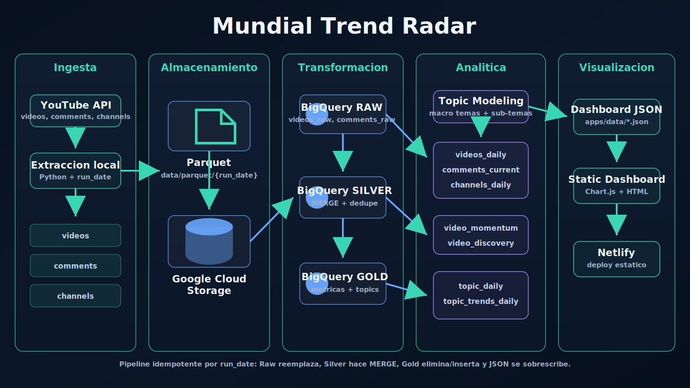

# Mundial Trend Radar Monterrey

Proyecto de portafolio para monitorear conversaciones publicas en YouTube sobre la Copa Mundial FIFA 2026 en Monterrey. El repositorio contiene un pipeline de datos en Python, capas de transformacion en BigQuery, modelado jerarquico de temas y un dashboard estatico que puede desplegarse sin exponer credenciales de nube en el navegador.



## Que Hace

- Busca videos publicos recientes de YouTube relacionados con el Mundial y Monterrey.
- Extrae metadatos publicos de videos, comentarios principales y metadatos de canales.
- Guarda snapshots Parquet particionados por `run_date` de forma local y, opcionalmente, los sube a Google Cloud Storage.
- Carga los snapshots crudos en BigQuery y construye capas analiticas Raw, Silver y Gold.
- Detecta macro temas y sub-temas a partir del texto de videos y comentarios seleccionados.
- Exporta archivos JSON listos para un dashboard estatico construido con Chart.js.

## Arquitectura

```text
YouTube Data API
  -> scripts de extraccion en Python
  -> archivos Parquet locales por run_date
  -> Google Cloud Storage
  -> tablas Raw en BigQuery
  -> tablas Silver en BigQuery
  -> tablas Gold en BigQuery
  -> exportacion JSON para dashboard
  -> dashboard estatico en apps/
```

| Capa | Ubicacion | Proposito |
| --- | --- | --- |
| Extraccion | `src/extract_videos.py`, `src/extract_comments.py`, `src/extract_channels.py` | Consulta la YouTube Data API y escribe archivos Parquet tipados. |
| Almacenamiento | `data/parquet/`, GCS | Guarda snapshots generados fuera del control de versiones. |
| Raw | Dataset raw en BigQuery | Conserva la salida cargada desde la extraccion. |
| Silver | Dataset silver en BigQuery | Deduplica y estandariza videos, comentarios y canales. |
| Gold | Dataset gold en BigQuery | Construye tablas de momentum, discovery, temas, canales y KPIs para el dashboard. |
| Exportacion JSON | `apps/data/`, `src/dashboard/data/` | Escribe datos estaticos para el dashboard. El JSON generado se ignora en Git. |
| Frontend | `apps/index.html` | Dashboard estatico desplegable en Netlify o cualquier hosting estatico. |

## Flujo De Datos

El entrypoint principal del pipeline es:

```bash
python src/pipeline.py
```

Flujo diario:

1. Busca en YouTube videos recientes sobre el Mundial y Monterrey.
2. Enriquece los videos con estadisticas y detalles de contenido.
3. Extrae comentarios publicos principales de los videos monitoreados.
4. Extrae metadatos publicos de los canales.
5. Sube los archivos Parquet generados a un bucket configurado de GCS.
6. Carga los archivos Parquet en tablas Raw de BigQuery.
7. Fusiona registros limpios en tablas Silver.
8. Construye tablas Gold de momentum y discovery.
9. Asigna macro temas y sub-temas, y despues agrega tendencias por tema.
10. Exporta archivos JSON estaticos usados por el dashboard.

`run_date` se calcula con la zona horaria de Monterrey y normalmente apunta al dia anterior.

## Dashboard

El dashboard estatico desplegable vive en:

```text
apps/index.html
```

Lee archivos JSON generados desde:

```text
apps/data/*.json
```

La copia fuente del dashboard vive en `src/dashboard/index.html`. El generador de JSON replica la salida en `apps/data/` y `src/dashboard/data/` para facilitar el desarrollo local.

## Tablas De BigQuery

Los archivos DDL estan en `src/load/sql/` y usan solamente nombres placeholder para proyecto y datasets:

- `raw_ddl.sql`: `videos_raw`, `comments_raw`, `channels_raw`
- `silver_ddl.sql`: `videos_daily`, `comments_current`, `channels_daily`
- `gold_ddl.sql`: `video_momentum`, `video_discovery`, `video_topics_daily`, `topic_daily`, `topic_trends_daily`, `channel_daily`, `dashboard_summary_daily`

Antes de ejecutar los DDL, reemplaza placeholders como `your_project.your_gold_dataset.table_name` por tu propio proyecto y datasets de GCP.

## Instalacion Local

Crea y activa un entorno virtual:

```bash
python -m venv venv
venv\Scripts\activate
pip install -r requirements.txt
python -m spacy download es_core_news_sm
```

En macOS o Linux:

```bash
python -m venv venv
source venv/bin/activate
pip install -r requirements.txt
python -m spacy download es_core_news_sm
```

Crea un archivo local `.env` a partir de la plantilla publica:

```bash
copy .env.example .env
```

En macOS o Linux:

```bash
cp .env.example .env
```

Variables de entorno requeridas:

```env
YOUTUBE_API_KEY=replace_with_your_youtube_api_key
GCP_PROJECT_ID=your-gcp-project-id
GCS_BUCKET_NAME=your-gcs-bucket-name
GOOGLE_APPLICATION_CREDENTIALS=src/credentials/service-account.json
```

Mantén `.env` y los archivos JSON de service account fuera del control de versiones. El `.gitignore` incluido bloquea rutas comunes de credenciales, datos generados y caches.

## Comandos Utiles

Ejecutar el pipeline completo:

```bash
python src/pipeline.py
```

Procesar temas para una fecha:

```bash
python src/transform/topic_gold.py --run-date 2026-06-15
```

Hacer backfill de temas:

```bash
python src/transform/topic_gold.py --start-date 2026-06-15 --end-date 2026-06-20
```

Regenerar JSON del dashboard:

```bash
python src/dashboard/generate_dashboard_json.py
```

Regenerar JSON del dashboard para una ventana explicita:

```bash
python src/dashboard/generate_dashboard_json.py --start-date 2026-06-15 --end-date 2026-06-20
```

## Despliegue

El sitio estatico esta configurado para Netlify:

```text
netlify.toml
```

El workflow programado de GitHub Actions ejecuta el pipeline con secretos del repositorio, regenera el JSON del dashboard y sube los datos generados como artifact del workflow. El JSON generado no se commitea intencionalmente porque puede contener extractos de comentarios publicos, identificadores de canales u otros datos que conviene revisar antes de publicar.

Configura estos secretos en GitHub antes de habilitar el workflow:

- `YOUTUBE_API_KEY`
- `GCP_PROJECT_ID`
- `GCS_BUCKET_NAME`
- `GCP_SERVICE_ACCOUNT_KEY`

## Estructura Del Repositorio

```text
.github/workflows/
  pipeline.yml
apps/
  index.html
  data/
docs/
  architecture-infrastructure.svg
  architecture-infrastructure.png
src/
  common.py
  pipeline.py
  extract_videos.py
  extract_comments.py
  extract_channels.py
  load_bq.py
  dashboard/
    generate_dashboard_json.py
    index.html
    data/
  load/
    bigquery.py
    gcs.py
    sql/
  transform/
    silver.py
    gold.py
    topic_gold.py
requirements.txt
netlify.toml
```

## Notas De Privacidad Y Seguridad

- El pipeline usa datos publicos de YouTube, pero los archivos Parquet y JSON generados pueden contener nombres de autores, comentarios, identificadores de canales, payloads crudos de API o rutas de infraestructura.
- Los datos generados, caches, credenciales, archivos `.env` locales y logs se ignoran en Git.
- El dashboard del navegador usa JSON estatico y nunca consulta BigQuery directamente.
- Antes de publicar un despliegue real, revisa los terminos de la YouTube API, las expectativas de retencion de datos y si los comentarios publicos deben agregarse o anonimizarse para tu caso de uso.
